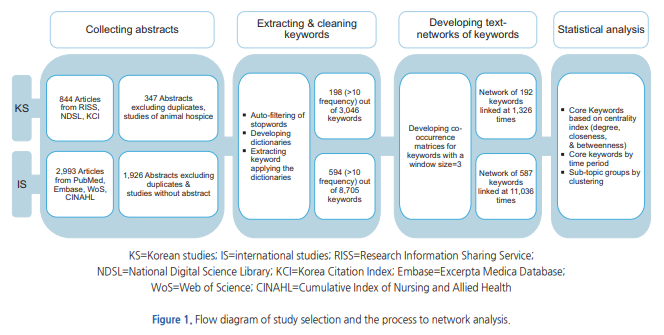

https://wikidocs.net/32829

https://bab2min.tistory.com/554

 

 

## 문서 단어 행렬(Document-Term Matrix, DTM)

문서 단어 행렬(Document-Term Matrix, DTM)이란 다수의 문서에서 등장하는 각 단어들의 빈도를 행렬로 표현한 것

**문서1 : 먹고 싶은 사과
문서2 : 먹고 싶은 바나나
문서3 : 길고 노란 바나나 바나나
문서4 : 저는 과일이 좋아요**

이를 문서 단어 행렬로 표현하면 다음과 같다.

| -     | 과일이 | 길고 | 노란 | 먹고 | 바나나 | 사과 | 싶은 | 저는 | 좋아요 |
| :---- | :----- | :--- | :--- | :--- | :----- | :--- | :--- | :--- | :----- |
| 문서1 | 0      | 0    | 0    | 1    | 0      | 1    | 1    | 0    | 0      |
| 문서2 | 0      | 0    | 0    | 1    | 1      | 0    | 1    | 0    | 0      |
| 문서3 | 0      | 1    | 1    | 0    | 2      | 0    | 0    | 0    | 0      |
| 문서4 | 1      | 0    | 0    | 0    | 0      | 0    | 0    | 1    | 1      |

각 문서에서 등장한 단어의 빈도를 행렬의 값으로 표기한다.

문서 단어 행렬은 문서들을 서로 비교할 수 있도록 수치화할 수 있다는 점에서 의의를 갖는다.

(한국어에서 불용어에 해당되는 조사들 또한 제거하여 더 정제된 DTM을 만들 수도 있다.)

 

### **문서 단어 행렬(Document-Term Matrix)의 한계**

DTM은 매우 간단하고 구현하기도 쉽지만, 본질적으로 가지는 몇 가지 한계들이 있다.

 

#### **1) 희소 표현(Sparse representation)**

DTM에서의 각 행을 문서 벡터라고 한다면 각 문서 벡터의 차원은 전체 단어 집합의 크기를 가진다.

만약 가지고 있는 데이터가 방대한 데이터라면 문서 벡터의 차원은 수백만의 차원을 가질 수도 있다.

또한 많은 문서 벡터가 대부분의 값이 0을 가질 수도 있다.

예로 들었던 문서 단어 행렬의 모든 행이 0이 아닌 값보다 0의 값이 더 많은 것을 볼 수 있다.

따라서 텍스트 전처리 방법을 사용하여 구두점, 빈도수가 낮은 단어, 불용어를 제거하고, 어간이나 표제어 추출을 통해 단어를 정규화하여 단어 집합의 크기를 줄일 필요가 있다.

 

#### **2) 단순 빈도 수 기반 접근**

여러 문서에 등장하는 모든 단어에 대해서 빈도 표기를 하는 이런 방법은 때로는 한계를 가지기도 한다.

예를 들어 영어에 대해서 DTM을 만들었을 때, 불용어인 `the`는 어떤 문서이든 자주 등장할 수 밖에 없다.

그런데 유사한 문서인지 비교하고 싶은 문서1, 문서2, 문서3에서 동일하게 the가 빈도수가 높다고 해서 이 문서들이 유사한 문서라고 판단해서는 안 된다.

각 문서에는 중요한 단어와 불필요한 단어들이 혼재되어 있다.

앞서 불용어(stopwords)는 자연어 처리에 있어 의미를 거의 갖지 못하는 단어이기 때문에 DTM에 불용어와 중요한 단어에 대해서 가중치를 주는 방법이 **TF-IDF** 이다.

 

 

## TF-IDF(Term Frequency-Inverse Document Frequency)

TF-IDF(Term Frequency-Inverse Document Frequency)는 단어의 빈도와 역 문서 빈도(문서의 빈도에 특정 식을 취함)를 사용하여 DTM 내의 각 단어들마다 중요한 정도를 가중치로 주는 방법이다.

 

### TF-IDF 한계

TF-IDF 모델은 최신 트랜드를 반영하는데 많은 어려움이 따르고 있다.

즉 최신 트랜드를 반영한 문서를 수집하는 범위를 확정하는 것이 어 려우며,

최신 트랜드를 반영하는 신조어 등장하는 경우, 신기술의 문서일 경우 특정 단어가 포함된 문서가 너무 많아 오히려 중요도가 낮아지는 현상까지 나타나고 있다.

 

 

## TF-DI(Term Frequency - Date Index)

TF-DI(Term Frequency - Date Index)는 텍스트마이닝 기법의 하나로써, 특정 키워드가 연도별로 얼마나 중요한지를 나타내는 가중치로 일종의 통계적 방법을 제시하고 있다.

이러한 방법은 TF-IDF의 변형하여 단점들을 보강하고 특정목적(트랜드 분석)을 위하여 개발되었다.

TF-DI의 가장 중요한 원리는 문서 내의 중요한 키워드들을 도출하여 인터넷의 정보량에 따라 단어의 빈도수를 분석하는 방식을 사용한다.

또한, 문서군 내의 특정단어의 문서간 빈도수를 사용하는 것이 아니라 연도별 가중치를 사용함으로써 트랜드 분석이 가능하도록 설계하였다.

즉 TF-IDF의 빈도수가 중요하다는 원리를 이용하지만, 트랜드를 분석하기 위하여 문서의 중요도는 인터넷을 활용한 연도별 가중치 분석으로 중요도를 분석하고 있다.

이러한 분석은 현재의 인터넷의 정보를 가중치로 이용하는 방법으로 현재의 데이터나 자료가 잘 반영되어 있다는 것이 장점이 있다.

 

### TF-IDF 와 TF-DI 의 차이점

- TF-IDF 빈도수분석은 문서 군들에 속해진 문서들의 빈도수를 이용하는 것이고, TF-DI은 중요하다고 생각되는 보고서, 논문 등의 중요문서들의 키워드들을 인터넷의 최근 검색 결과값을 들을 빈도수로 이용하는 것이다. 

  이 빈도수는 특정한 문서군에 국한되지 않으며, 최근의 트랜드를 반영하는 지표가 된다.

- TF-IDF 는 문서간 특정단어의 속한 문서들의 수에 따라 중요도를 판별하였으나, TF-DI에서는 시간의 개념을 변수로 사용하여 중요도를 산정하였다.

  이는 시간개념을 도입함으로써, 최근까지의 트랜드를 분석할 수 있는 유용한 방법으르 제시하고 있다.

- TF-IDF의 중요도는 어떤 문서군을 선택하는 냐에 따라 편차가 심하게 발생하나, TF-DI는 인터넷을 이용한 결과값들을 사용하기 때문에 오차도 적을뿐더러 다양한 조건하에 값들을 중요도를 추출하고 트랜드를 분석할 수 있다.

 

 

## Ref.

#### (2019) 텍스트 마이닝과 언어네트워크 분석을 활용한 국외 교사교육자 연구 동향 분석 - 부산대

본 연구의 목적은 교사교육자 를 주제어로 2008년부터 2018년까지 Web of Science 데이터베이스에서 수록된 국제 학술지에 게재된 연구논문들을 텍스트 마이닝과 언어네트워크분석을 활용하여 연구 동향을 파악함으로써 한국 교사교육자 연구 발전을 위하여 시사점을 얻고자 한다.

본 연구의 절차를 보면 주로 넷 단계로 요약할 수 있다.

- 첫 번째 단계에서는 데이터베이스를 통해 2008년부터 2018년까지 교사교육자와 관련된 학술지 논문의 제목 요약 키워드 저자 발행 연도 학술지명 참고문헌 등을 수집하여 추출하였고 저장하였다.

- 두 번째 단계에서는 수집된 자료를 BICOMB2.0 프로그램을 통하여 빈도 백분율 등을 확인하였고 단어 공동 출현 매트릭스를 도출하였다.

- 키워드 빈도 분석하기 위하여 키워드 단복수 대소문자 품사형태 등을 교정작업을 하였고 유사한 내용을 가진 유사어 등을 적절한 단어로 변경작업을 하였다.

  빈도 5회 이상으로 나타난 키워드들은 공동 출현 매트릭스를 생성하여 도출하였다.

- 세 번째 단계에서는 공통 출현 키워드 매트릭스 파일을 UCINET 6프로그램을 통하여 언어 네트워크 구조적 특징을 분석하였다.

  본 연구에서는 밀도 등 전체 네트워크 특징을 산출하였고 연결 정도 중심성 근접 중심성 중개 중심성 등 종 중심성 분석 및 분석을 실시하여 집단 간의 관계를 파악하였다.

- 마지막 단계에서는 NetDraw 프로그램을 통하여 시각화 표현하였다.

  전체 언어 네트워크 지도는 개의 상위 출현 빈도 키워드를 노드로 연결 정도를 링크로 시각화가 되었다.

 

#### (2019) 간호학 학술논문의 주제 분석을 위한 텍스트네크워크분석방법 활용 - 박찬숙

학술문헌을 텍스트 자료로 이용한 텍스트네트워크분석방법의 장점과 연구절차에 대한 본 고찰을 통해 연구를 시작하는 연구자들이 시행착오를 줄이고 보다 효율적인 연구과정을 수행하게 되기를 기대한다.

본 고찰을 토대로 다음의 제언을 하였다.

- 텍스트의 경계로 초록을 선택하는 것이 저자키워드만을 선택하였을 때보다 전처리 과정에서 시간과 노력이 많이 들지만 의미구조를 맥락화하는 데 도움이 된다.
그러나 저자키워드 분석은 공인된 용어나 전문 연구자가 선택한 용어를 활용하고 시간과 노력이 절약되는 장점이 있다.

- 텍스트네트워크분석방법을 다양한 주제 영역에서 적용할 수 있으므로 연구동향을 다차원적으로 탐색하는 정교한 연구설계의 개발이 필요하다.

 

#### (2017) 텍스트네트워크분석을 활용한 국내외 호스피스 간호 연구 주제의 비교 분석 - 한국간호과학회

본 연구는 국내·외 간호학 분야의 호스피스 연구 중 학술지에 출판된 논문의 초록을 자료 범위로 설정하고, 키워드 동시출현 관계를 파악하였다.

텍스트네트워크분석에서 연구대상 자료의 경계를 설정하는 것은 정확한 연구 결과를 얻기 위해 매우 중요하다.

연구문헌 분석에서 저자가 제시한 키워드가 종종 이용되지만, 저자 키워드만으로는 연구 내용을 제대로 파악할 수 없을 수 있고,

저자가 원하는 키워드를 선정하는 색인자 효과(indexer effect)로 인해 편이(bias)의 우려가 있다.

따라서 본 연구는 연구대상 자료의 경계를 논문 초록으로 설정하고 초록에서 추출한 의미형태소를 ‘키워드(keywords)’, 특히 상위 30개 키워드를 ‘핵심 키워드(core keywords)’라고 명명하였다.

연구 절차는 1) 논문의 수집과 초록 추출, 2) 초록의 키워드 추출 및 정제, 3) 키워드 간 동시출현 매트릭스 및 네트워크 생성, 4) 네트워크 통계분석 순으로 진행되었다.

 

#### (2016) 키워드 네트워크의 클릭 분석을 이용한 특허 데이터 분석 - 동덕여대, 한국데이터정보과학회지

기계 학습 관련 미국 특허 정보를 수집하여 분석하였다.

기계 학습은 인공 지능의 한 분야로서 최근 그 관심이 폭발적으로 증가하였다.

따라서 과거 출원된 특허와 최근 출원된 특허의 동향을 비교하고자 2005년도와 2015년도에 각각 출원된 특허 전체를 수집하였다.

특허 문서의 내용을 고려하면서 전체적인 연결 관계를 파악하고자 키워드 네트워크를 구축하고 키워드 네트워크 분석 및 클릭 분석을 시행하였다.

키워드 네트워크를 구축하는 데 있어 성패를 좌우하는 것이 키워드 선정이라는 것에 주목하여 TF-IDF 가중치를 기준으로 중요 키워드를 추출한 다음, 각 중요 키워드와 동시에 사용된 키워드를 연결 관계로 하여 키워드 네트워크를 구축하였다.